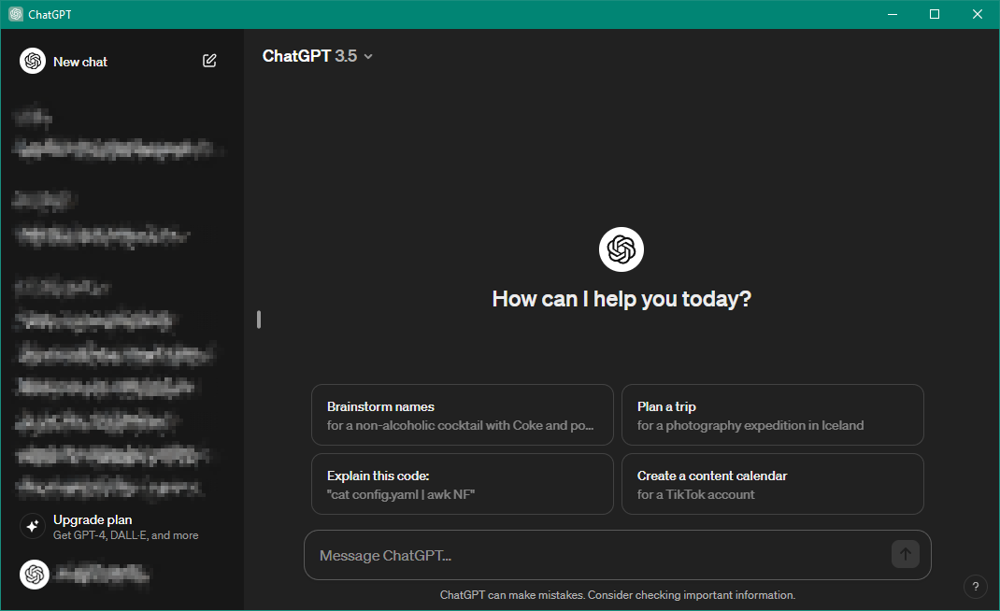

# ChatGPT Desktop Wrapper



This project aims to provide a simple Electron wrapper for ChatGPT, allowing users to run it as a standalone desktop application with minimal distractions.

## Features

- Provides a standalone window for ChatGPT, allowing users to move it to a separate screen or workspace.
- Ideal for users with ultra-wide monitors who want to have ChatGPT running alongside other applications.
- Cross-platform: Runs on Linux, macOS, and Windows.

### Installation

#### Windows

Download the executable file from the [releases](https://github.com/derDere/openAiWrapper/releases) section.

#### Other Platforms

You can build the application using npm, Node.js, and Electron. Clone the repository and run the following commands:

```bash
npm install
npm run build
```

After running the `npm run build` command, you will find the executable file for your platform in the newly created directory. Simply run the executable to launch the ChatGPT desktop wrapper.

Alternatively, you can run the application directly using:

```bash
npm start
```

This will launch the application in development mode.

## Command Line Arguments

You can customize the behavior of the application using the following command line arguments:

- `--light-mode` or `-l`: Enables light mode (default: false). (This will only change the window Background! You will have to turn on Light or Dark mode on the website to!)
- `--zoom` or `-z`: Adjusts the zoom level of the application (default: 1.0).

For example:

```bash
npm start -- --light-mode --zoom=2
ChatGPT.exe --light-mode --zoom=2
```

## Usage

Simply launch the application, and you'll see ChatGPT loaded in a standalone window. There are no additional features or configurations; it's just ChatGPT in its pure form. Login and thats it. Light and Dark mode is managed via the normal ChatGPT website.

## Offline Access

Please note that this wrapper only loads the ChatGPT website, so it requires an internet connection to function.

## Contribution

This project is open-source under the GNU General Public License Version 3. Contributions are welcome via GitHub.

## License

This project is licensed under the GNU General Public License Version 3. See the [LICENSE](https://github.com/derDere/openAiWrapper/blob/main/LICENSE) file for more details.

## Support

For any questions or issues, please [open an issue](https://github.com/derDere/openAiWrapper/issues) on GitHub.
